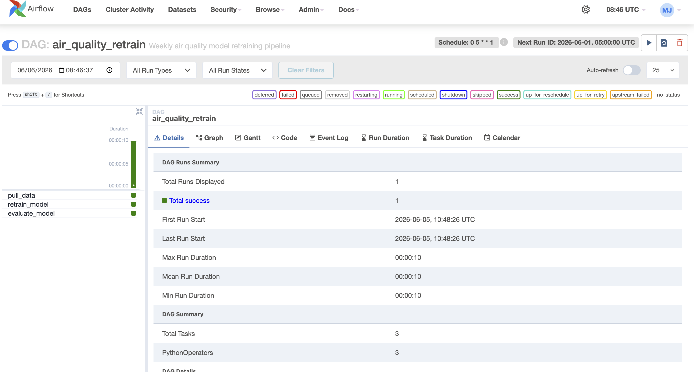
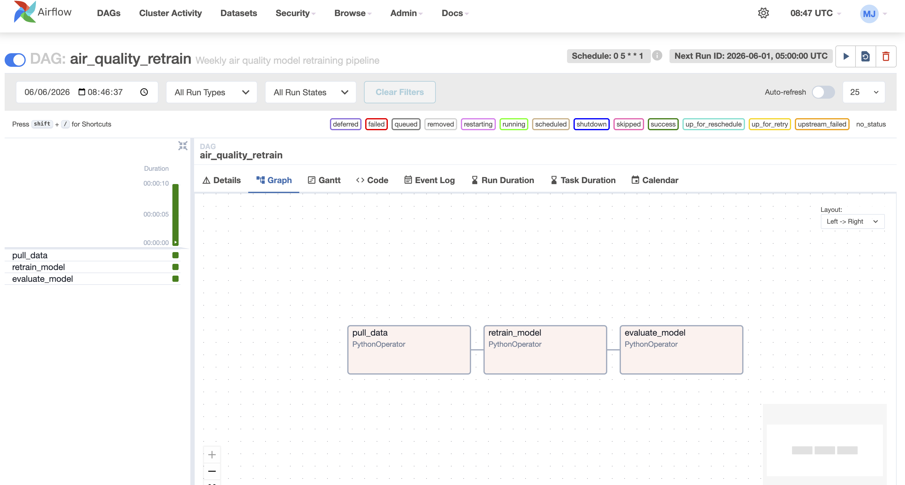
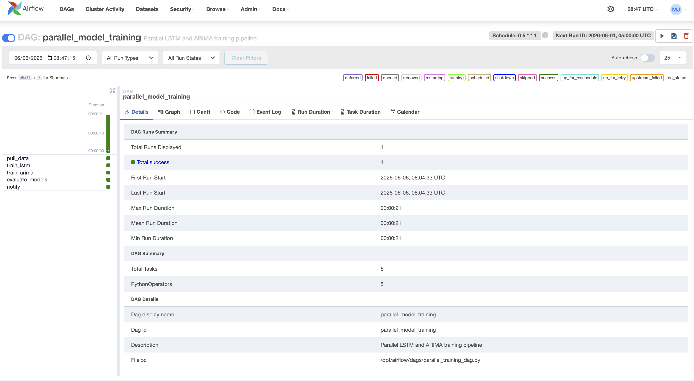
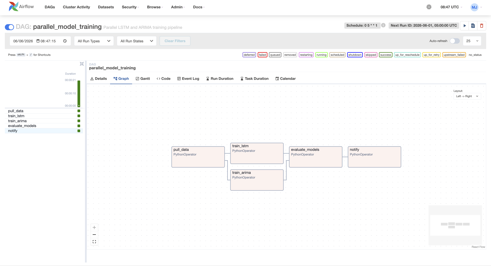

# Apache Airflow — ML Pipeline Orchestration


**Production ML pipeline orchestration on AWS EC2 Frankfurt — automated retraining, parallel model training, and scheduled monitoring.**


> ⚡ **Live Airflow UI** → http://3.67.15.230:8080
>
>
> 🔗 **Air Quality Pipeline** → https://github.com/M20Jay/air-quality-anomaly-detection

---

## The Problem This Solves

Without orchestration, ML pipelines must be triggered manually. A model trained in January on Nairobi dry-season data is still running in June on wet-season data — **silent concept drift**. Airflow schedules automatic retraining every Monday at 5am, ensuring the model stays current without human intervention.

> *"A model trained once and never monitored is not a production system — it is a time bomb."*

---

## Architecture

```
AWS EC2 t3.medium Frankfurt (3.67.15.230)
    ↓
Docker Compose — 5 Airflow containers
    ├── airflow-webserver  → UI on port 8080
    ├── airflow-scheduler  → reads DAGs, triggers tasks
    ├── airflow-triggerer  → handles deferred tasks
    ├── postgres           → Airflow metadata database
    └── redis              → task queue broker
    ↓
~/airflow-docker/dags/
    ├── air_quality_dag.py          → weekly retraining pipeline
    └── parallel_training_dag.py   → parallel model comparison
    ↓
Systemd service → auto-starts on server reboot
```

---

## DAG 1 — Air Quality Weekly Retraining

**Schedule:** Every Monday at 5am | **Tasks:** 3 | **Executor:** LocalExecutor

### Dashboard


### Pipeline Structure


```
pull_data → retrain_model → evaluate_model
```

| Task | Purpose |
|------|---------|
| `pull_data` | Fetches fresh PM2.5 readings from OpenAQ API |
| `retrain_model` | Retrains ARIMA model on new data |
| `evaluate_model` | Compares new RMSE against baseline 9.93 µg/m³ |

**Why weekly retraining matters:** Evidently AI detected PM2.5 mean shift from **19.02 → 12.50 µg/m³** in Week 8 — seasonal data drift from dry season to wet season. Without automated retraining, this drift compounds silently and degrades forecast accuracy over time.

---

## DAG 2 — Parallel Model Training

**Schedule:** Every Monday at 5am | **Tasks:** 5 | **Executor:** LocalExecutor

### Dashboard


### Pipeline Structure — Parallel Execution


```
pull_data → [train_lstm + train_arima] → evaluate_models → notify
```

| Task | Purpose | Runs |
|------|---------|------|
| `pull_data` | Fetches fresh air quality data | Sequential |
| `train_lstm` | Trains LSTM model | **Parallel** |
| `train_arima` | Trains ARIMA model | **Parallel** |
| `evaluate_models` | Compares RMSE — selects winner | Sequential |
| `notify` | Reports pipeline completion | Sequential |

**Why parallel:** LSTM and ARIMA training are independent — no reason to run them sequentially. The `[lstm, arima]` syntax triggers both simultaneously, cutting training time in half.

**Current winner:** ARIMA — RMSE **9.93 µg/m³** vs LSTM **19.46 µg/m³** on 1,620 hourly readings. See [Week 6 Deep Dive](https://github.com/M20Jay/air-quality-anomaly-detection/blob/main/notes/WEEK_06_NOTES.md) for full analysis.

---

## Tech Stack

| Tool | Version | Purpose |
|------|---------|---------|
| Apache Airflow | 2.10.5 | Pipeline orchestration |
| Docker Compose | Latest | Container management |
| LocalExecutor | — | Task execution without worker container |
| PostgreSQL | 13 | Airflow metadata storage |
| Redis | 7.2 | Task queue broker |
| AWS EC2 | t3.medium | Cloud deployment — 4GB RAM |
| Python | 3.11 | DAG development |

---

## Airflow vs Cron — Why It Matters

| Feature | Cron | Apache Airflow |
|---------|------|----------------|
| Task dependencies | ❌ None | ✅ Explicit — pull before retrain |
| Failure handling | ❌ Silent failure | ✅ Retry logic + alerts |
| Visibility | ❌ No logs | ✅ Full task logs in UI |
| Parallel execution | ❌ Not supported | ✅ Native `[task1, task2]` |
| Run history | ❌ None | ✅ Full history with durations |
| Monitoring | ❌ None | ✅ Live dashboard |

---

## Key Concepts

### DAG — Directed Acyclic Graph
A DAG defines tasks and their dependencies with no circular loops. Directed means tasks have a defined order. Acyclic means no task can create a cycle. Graph means the structure is visualised as nodes and edges.

### Parallel Execution
```python
# Sequential — one after another
pull_data >> retrain >> evaluate

# Parallel — both run simultaneously
pull_data >> [train_lstm, train_arima] >> evaluate >> notify
```
Square brackets tell Airflow to start both tasks at the same time.

### LocalExecutor vs CeleryExecutor
LocalExecutor runs tasks in the same process as the scheduler — no worker container needed. Saves ~400MB RAM on a t3.medium running 8 production APIs simultaneously. CeleryExecutor adds distributed worker containers — appropriate for larger compute requirements.

### Cron Schedule Syntax
```
0 5 * * 1
│ │ │ │ └── Day of week (1 = Monday)
│ │ │ └──── Month (* = every month)
│ │ └────── Day of month (* = every day)
│ └──────── Hour (5 = 5am UTC)
└────────── Minute (0 = on the hour)
```

---

## CLI Reference

### Start Airflow

```bash
# SSH to server
ssh -i ~/Documents/GitHub/mlops-key.pem ubuntu@3.67.15.230

# Start containers (no worker — saves RAM)
cd ~/airflow-docker
docker compose up -d --scale airflow-worker=0

# Verify all healthy
docker compose ps

# Check memory
free -h
```

### DAG Management

```bash
# List all DAGs
docker exec airflow-docker-airflow-scheduler-1 airflow dags list

# Trigger DAG manually
docker exec airflow-docker-airflow-scheduler-1 \
  airflow dags trigger air_quality_retrain

# Check run status
docker exec airflow-docker-airflow-scheduler-1 \
  airflow dags list-runs -d air_quality_retrain

# Pause / unpause
docker exec airflow-docker-airflow-scheduler-1 airflow dags pause parallel_model_training
docker exec airflow-docker-airflow-scheduler-1 airflow dags unpause parallel_model_training
```

### Deploy New DAG from Mac to Server

```bash
# Upload DAG file
scp -i ~/Documents/GitHub/mlops-key.pem \
  ~/Documents/GitHub/airflow-mlops-pipeline/dags/new_dag.py \
  ubuntu@3.67.15.230:~/airflow-docker/dags/

# Airflow detects new DAGs automatically within 30 seconds
```

### Systemd Service

```bash
# Check service status
sudo systemctl status airflow.service

# Enable auto-start on reboot
sudo systemctl enable airflow.service

# Restart
sudo systemctl restart airflow.service
```

---

## Deliverables

| Component | Status |
|-----------|--------|
| Airflow 2.10.5 on AWS EC2 t3.medium | ✅ Running |
| air_quality_retrain DAG | ✅ Live — runs every Monday 5am |
| parallel_model_training DAG | ✅ Live — parallel execution confirmed |
| Systemd auto-start on reboot | ✅ Enabled |
| Airflow UI accessible | ✅ http://3.67.15.230:8080 |
| Both DAGs pushed to GitHub | ✅ This repository |

---

## Connection to Week 6

This repo orchestrates the system built in [Week 6 — Air Quality Anomaly Detection](https://github.com/M20Jay/air-quality-anomaly-detection).

| Week 6 Built | Week 9 Automates |
|-------------|-----------------|
| ARIMA model — RMSE 9.93 µg/m³ | Weekly retraining when drift detected |
| Evidently AI drift detection | Scheduled drift check every Monday |
| Manual model comparison | Automated parallel LSTM vs ARIMA |
| One-time training run | Continuous learning pipeline |

---

## Progress

| Day | Task | Status |
|-----|------|--------|
| Day 1 | Infrastructure setup — swap, Docker, LocalExecutor | ✅ |
| Day 2 | t3.medium upgrade, port 8080, Airflow UI | ✅ |
| Day 3 | First DAG — air_quality_retrain — ran successfully | ✅ |
| Day 4 | Parallel DAG — LSTM + ARIMA simultaneously | ✅ |
| Day 5 | GitHub repo, README, assets | ✅ |
| Day 6 | Week 9 notes — pushed to GitHub | ✅ |
| Day 7 | LinkedIn post + GitHub profile update | ✅ |

---

*Week 9 of 15 · Apache Airflow ML Orchestration · Built in Nairobi, Kenya 🇰🇪*
*Part of a 15-week MLOps programme building production ML systems from scratch.*
*github.com/M20Jay*
